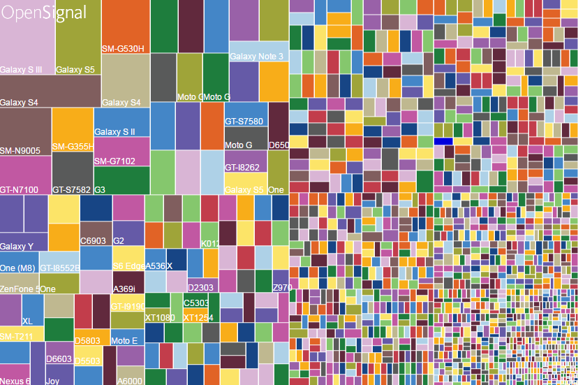
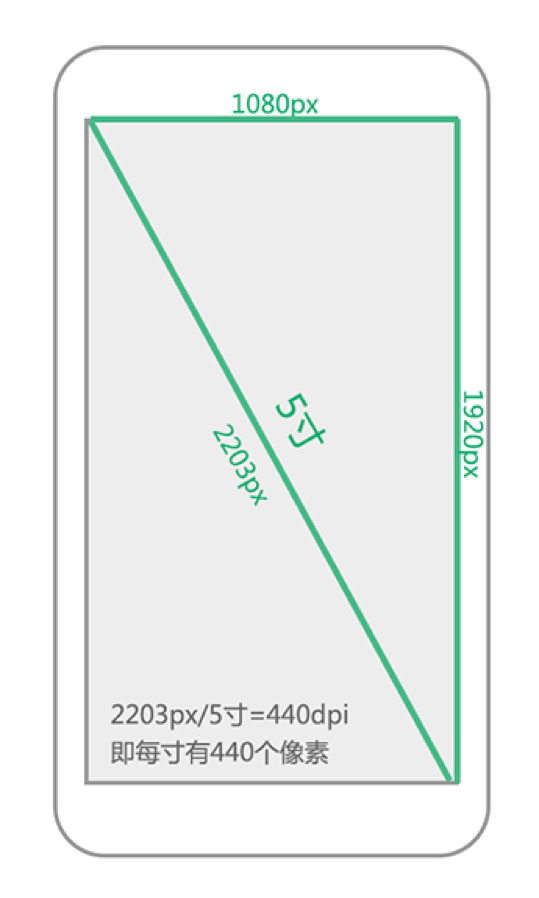

# 为什么要屏幕适配？ #

## 统计 ##
* [OpenSignal](https://opensignal.com/reports/2015/08/android-fragmentation/)
* [友盟统计](http://www.umindex.com/)

## 碎片化 ##

* 品牌机型碎片化
* 屏幕尺寸碎片化
* 操作系统碎片化

为了保证用户获得一致的用户体验效果，使得某一元素在Android不同尺寸、不同分辨率的手机上具备相同的
显示效果，则需要我们进行屏幕适配。

# 基础概念 #

## 屏幕尺寸 ##
屏幕尺寸是指屏幕对角线的长度，单位是英寸，1 inch=2.54 cm

## 屏幕分辨率 ##
手机在横向和纵向上的像素点数总和，单位是像素（pixel)，1px = 1像素点，
举个栗子，1080x1920，即宽度方向上有1080个像素点，在高度方向上有1920个像素点。

## 屏幕像素密度 ##
每英寸像素点个数，单位是dpi，dots per inch。
为简便起见，Android 将所有屏幕密度分组为六种通用密度： 低、中、高、超高、超超高和超超超高。

* ldpi（低）~120dpi
* mdpi（中）~160dpi
* hdpi（高）~240dpi
* xhdpi（超高）~320dpi
* xxhdpi（超超高）~480dpi
* xxxhdpi（超超超高）~640dpi

## 屏幕密度无关像素dp(dip) ##
Density Independent Pixels，即密度无关像素

* 160dpi, 1dp = 1px
* 240dpi, 1dp = 1.5px
* 320dpi, 1dp = 2px
* 480dpi, 1dp = 3px
* 640dpi, 1dp = 4px

### 使用px在低、中、高屏幕密度下的效果###

### 使用dp在低、中、高屏幕密度下的效果 ###

## 独立比例像素sp ##
Scale Independent Pixels, 即sp或sip。
Android开发时用此单位设置文字大小，可根据字体大小首选项进行缩放，推荐使用12sp、14sp、18sp、22sp作为字体设置的大小，不推荐使用奇数和小数，容易造成精度的丢失问题,
小于12sp的字体会太小导致用户看不清。

# 屏幕适配之图片适配 #

在设计图标时，对于5种主流的像素密度(mdpi,hdpi,xhdpi,xxhdpi和xxxdpi)应按照
2:3:4:6:8的比例进行缩放。例如一个启动图片ic_launcher.png,它在各个像素密度文件夹下大小为：

* ldpi（低）
* mdpi（中）48*48
* hdpi（高）72*72
* xhdpi（超高）96*96
* xxhdpi（超超高）144*144
* xxxhdpi（超超超高）192*192

## 存在的问题 ##
* 每套分辨率出一套图，为美工或者设计增加了许多工作量
* 对Android工程文件的apk包变的很大

## 解决方法 ##
### Android SDK加载图片流程 ###
1. Android SDK会根据屏幕密度自动选择对应的资源文件进行渲染加载，比如说，SDK检测到你手机的分辨率是xhdpi，会优先到xhdpi文件夹下找对应的图片资源；
2. 如果xhdpi文件夹下没有图片资源，那么就会去分辨率高的文件夹下查找，比如xxhdpi，直到找到同名图片资源，将它按比例缩小成xhpi图片；
3. 如果往上查找图片还是没有找到，那么就会往低分辨率的文件夹查找，比如hdpi，直到找到同名图片资源，将它按比例放大成xhpi图片。

###那么应该提供哪种分辨率规格呢？###

**原则上越高越好，同时结合当前主流分辨率屏幕**

目前推荐xhdpi:

1. xhdpi目前主流
2. 如果选用太低分辨率的图片，那么在高分辨率手机上显示就会模糊
3. iPhone主流的屏幕dpi约等于320, 刚好属于xhdpi，射击师只需切一套图就好了。

## 图片自动缩放 ##

# 屏幕适配之布局适配 #
## 布局参数 ##
使用wrap_content, match_parent, weight。

## 布局容器 ##
使用相对布局，禁用绝对布局。

## 限定符 ##
### 尺寸限定符 ###
* 在手机较小的屏幕上，加载layout文件夹布局
* 在平板电脑和电视的屏幕（>7英寸）上， 加载layout-large文件夹的布局
* Android3.2版本之前
### 最小宽度限定符 ###
* 在手机较小的屏幕上，加载layout文件夹布局
* 标准7英寸平板（其最小宽度为 600 dp），加载layout-sw600dp文件夹的布局
* 在Android3.2版本及之后版本
### 布局别名 ###

### 屏幕方向限定符 ###

# 屏幕适配之Dimen适配 #

# 屏幕适配之自适应用户界面流程 #

# 参考 #
* [Android官网](https://developer.android.com/guide/practices/screens_support.html)
* [Android开发：最全面、最易懂的Android屏幕适配解决方案](http://www.jianshu.com/p/ec5a1a30694b)